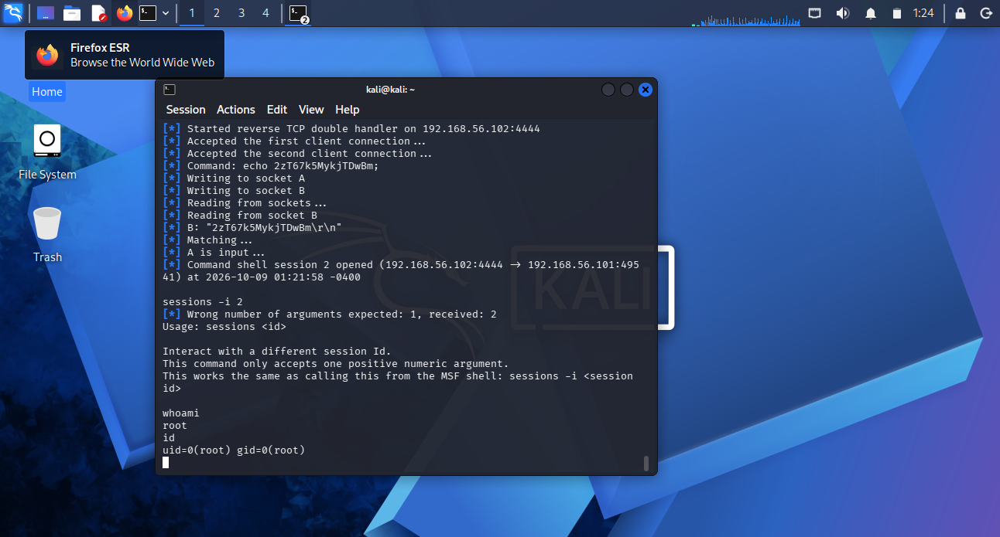
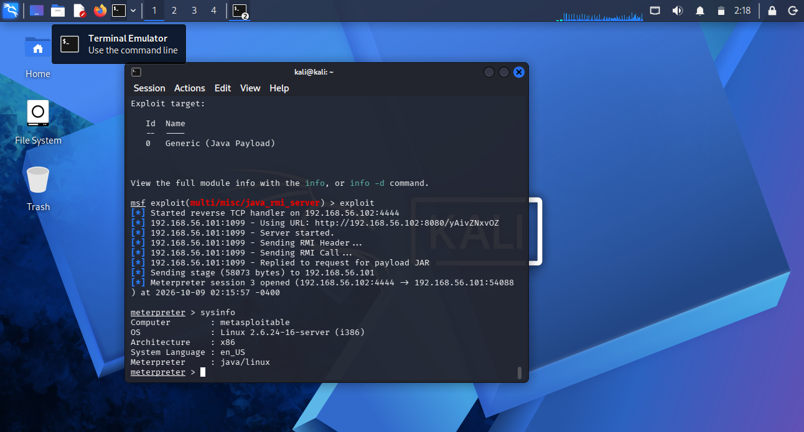
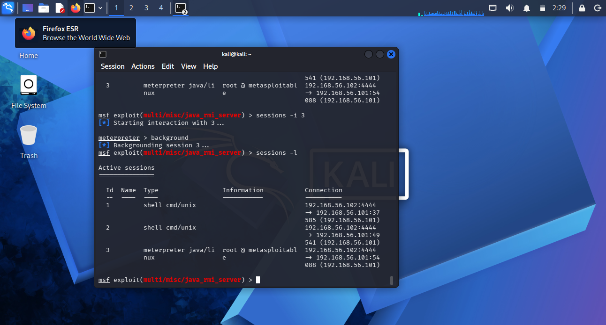
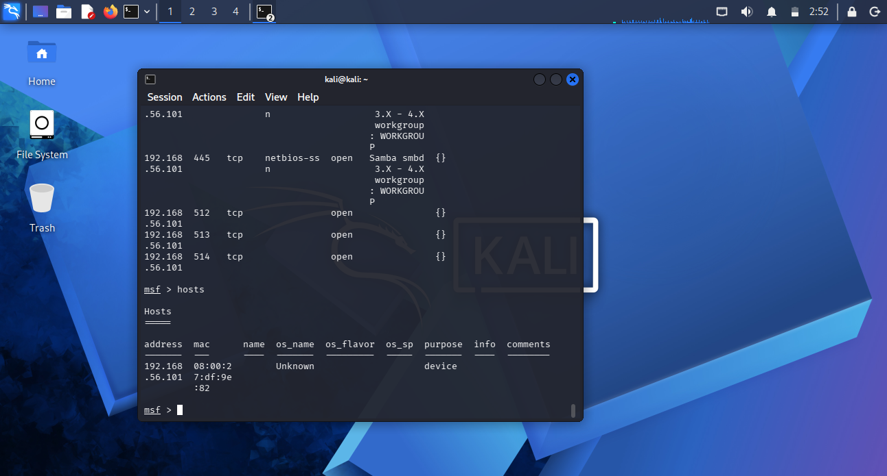
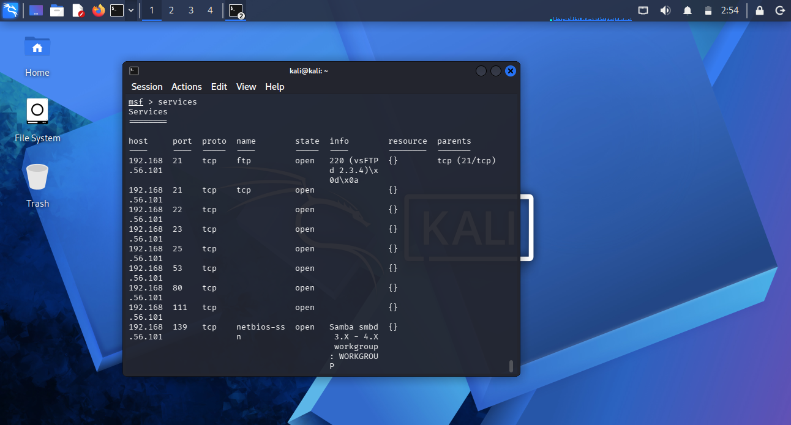

## Exercise 3:VSFTPD Backdoor Exploitation
## Procedure: I selected the exploit/unix/ftp/vsftpd_234_backdoor module,target IP to 192.168.56.101 and ran the exploit
## Result: A command shell was successfully obtained. The whoami and id commands confirmed root access

 ## Exercise 4: Samba Usermap Script Exploitation
## Procedure: I Selected the `exploit/multi/samba/usermap_script` module and configured the target IP address as `192.168.56.101`. Then, I ran the exploit against the Metasploitable2 virtual machine.
## Result: A command shell was successfully obtained. The `whoami` and `id` commands confirmed that the session had root privileges

## Exercise 5: Meterpreter Session
## Procedure: I Selected the `exploit/multi/misc/java_rmi_server` module and configured the target IP address as `192.168.56.101`, with the Kali Linux IP address `192.168.56.102` as the local host (LHOST). The payload `java/meterpreter/reverse_tcp` was selected, and the exploit was executed.
## Result: A Meterpreter session was successfully established. The `sysinfo` command displayed information about the target system, and `getuid` confirmed root privileges.

## Exercise 6: Meterpreter Commands and Session Management
## Procedure: I Used the Meterpreter session to run `pwd`, `ls`, and `getuid`. Then, entered a system shell to execute `uname -a`, returned to Meterpreter, and backgrounded the session. Finally, ran `sessions -l` to list the available sessions.
## Result: The commands displayed the current working directory, listed files, showed the user privileges, and provided system information. The session list confirmed that the available sessions were maintained in Metasploit.

## Exercise 8: Metasploit Database Review
## Procedure: I Ran `hosts`, `services`, `vulns`, `creds`, and `loot` to review the collected lab data.
## Result: Reviewed the target host, discovered services, vulnerability records, credentials, and stored loot.
## Hosts:

## Services:

